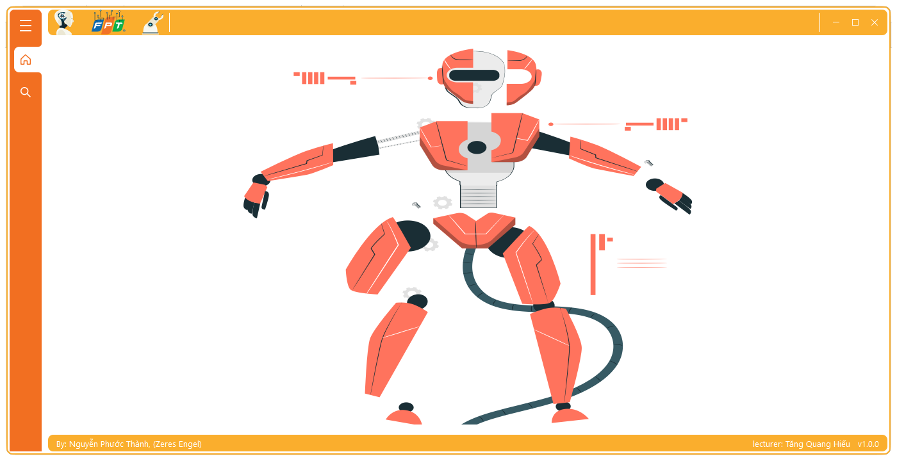
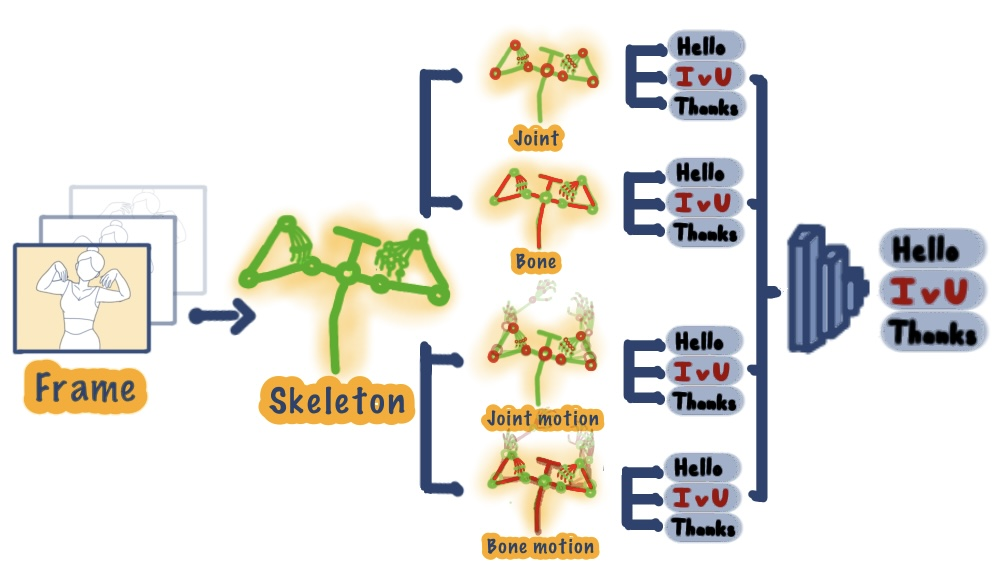
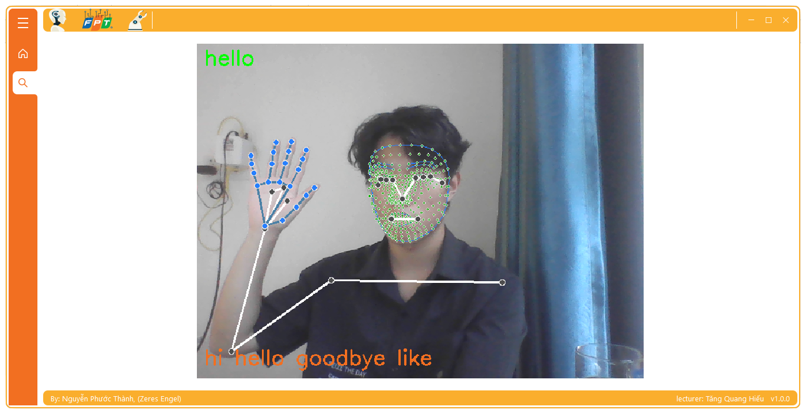

# FPT S2L

<div>
  <p align="center">
     
  </p>
</div>

Welcome to **FPTs2l** - the FPT Sign Language Translation app, a cutting-edge solution that draws inspiration from the research outlined in my paper **Exploring MediaPipe Optimization Strategies for Real-Time Sign Language Recognition**. This app is meticulously designed to bridge the communication gap for individuals with hearing impairments. By harnessing insights from your paper, **FPTs2l** empowers users with an innovative approach that facilitates seamless interaction and understanding through sign language translation.

<p align="center">
  
  
  
  
  
  <a href="https://github.com/Zeres-Engel"></a>
</p>


# Table of Content
- [Overview](#overview)
- [Operational Principles](#operational-principles)
- [Deploying the Product](#deploying-the-product)
    - [User Interface](#user-interface)
    - [Configuration](#configuration)

## Overview

The **FPTs2l** application is designed to provide enhanced communication support for individuals with hearing impairments. The core functionality of the application involves real-time sign language translation utilizing MediaPipe and LSTM network technology. Here's a high-level overview of how the application works.

  

## Operational Principles

1. **Pose Estimation with MediaPipe**: The application utilizes the power of Google's MediaPipe library to detect and track the skeletal structure of a single individual captured by the device's camera. This real-time pose estimation enables the identification of hand gestures and movements essential for sign language.

2. **Coordinate Input to LSTM Network**: The coordinates of the detected skeletal keypoints are extracted from the MediaPipe output. These coordinates are then fed into an LSTM (Long Short-Term Memory) neural network. LSTM networks are particularly suited for sequence-to-sequence tasks like capturing the dynamics of sign language gestures over time.

3. **Words Recognition**: The LSTM network processes the sequence of skeletal coordinates and attempts to recognize the sign language words being expressed by the user. The network has been trained on a dataset of sign language gestures to learn the mapping between input sequences and their corresponding words or phrases.

4. **Text Output**: The recognized sign language words are then translated into text, which is displayed on the user interface. This enables not only the person using the application but also those interacting with them to understand the conveyed message.

The **FPTs2l** application aims to empower individuals with hearing impairments by providing them with an efficient tool to communicate through gestures and receive real-time translations. By leveraging the capabilities of both MediaPipe and LSTM networks, the application bridges the communication gap and fosters inclusivity in various situations.

  

## Deploying the Product

Welcome to **FPTs2l**, an innovative application designed to facilitate seamless communication for individuals with hearing impairments. **FPTs2l** empowers users to bridge the communication gap by converting sign language gestures into comprehensible text, fostering enhanced understanding and interaction.

  ### User Interface

  The user interface of **FPTs2l** has been carefully crafted to provide an intuitive and user-friendly experience:

  - **Feature**: Sign to Words

  The heart of the application lies in the "Sign to Words" feature. Users can use their device's camera to capture sign language gestures, and **FPTs2l** will process these gestures using a sophisticated LSTM network. The application then displays the recognized text, making it possible for both users and their counterparts to comprehend the conveyed message.

  


  ### Configuration

  To run the **FPTs2l** application, follow the steps below:

  1. Install Dependencies:
    Make sure you have the required dependencies installed in your environment. You can install them by running the following command:
      ```shell
      conda env create -f environment.yml
      ```

  2. Download the Models:
    Download the models folder from the following [link](https://drive.google.com/drive/folders/1DFZ7nF60rF4tt1urFSbvffG-iWUnuxTW?usp=sharing) and move to **./gui/**

  3. Run the Application:
    Once the dependencies are installed, you can run the application using the following command:
      ```shell
      python main.py
      ```
